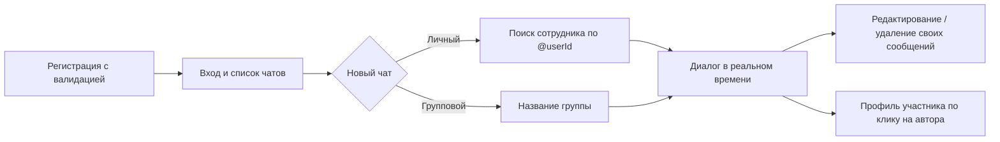

# CorpChat — корпоративный мессенджер для совместной работы

Веб-приложение для обмена сообщениями: личные и групповые чаты, поиск сотрудников,
права на собственный контент, профиль участника.
Учебный продуктовый кейс полного цикла: **discovery → требования → архитектура → разработка → приемка**.

| | |
|---|---|
| **Роль** | Product Owner + backend-разработчик |
| **Бэкенд** | Java · Spring Boot · Spring Data JPA · PostgreSQL · WebSocket/STOMP |
| **Клиент** | Vanilla JS + CSS (без фреймворков), SockJS/STOMP |
| **Инструменты** | Postman (приемочное тестирование), Git, Docker, SLF4J-логирование |


<!-- TODO: скриншоты интерфейса (список чатов + диалог) в docs/screenshots/ -->

---

## 1. Проблема и discovery

**Контекст.** Рабочая переписка распределённых команд оседает во внешних каналах:
сообщения теряются, права доступа не контролируются, история не принадлежит компании.

**Выявленная потребность.** Единый внутренний канал мгновенной коммуникации
с управляемым доступом к контенту.

| Гипотеза | Принятое продуктовое решение |
|---|---|
| Сотрудникам критична мгновенность | Доставка через WebSocket/STOMP: отдельный топик на каждый чат |
| Автор должен контролировать свой контент | Редактирование и удаление — только по праву авторства |
| Команды формируются динамически | Два типа чатов: личный (через поиск по @userId) и групповой |
| Конфиденциальность обязательна | DTO-контракты: пароль и внутренние поля не покидают сервер |

## 2. Пользовательский сценарий (user flow)



## 3. Ролевая модель доступа

| Действие | Автор | Другой участник | Не участник чата |
|---|:---:|:---:|:---:|
| Отправить сообщение в чат | ✅ | ✅ | ❌ |
| Редактировать сообщение | ✅ | ❌ | ❌ |
| Удалить сообщение | ✅ | ❌ | ❌ |
| Начать личный чат с сотрудником | ✅ | ✅ | ✅ |

Права проверяются на сервисном слое до изменения данных, а не в интерфейсе.

## 4. Требования → решения

| FR | Требование | Реализация |
|---|---|---|
| FR-1 | Мгновенная доставка сообщений | WebSocket/STOMP, топик `/topic/chat/{id}`, broadcast после сохранения |
| FR-2 | Защита конфиденциальных данных | DTO: `UserProfileDto` (профиль без пароля), `LoginRequest`, `CreateChatRequest` |
| FR-3 | Валидация входящих данных | Правила на бэкенде (400 с понятной ошибкой) + подсветка полей на клиенте |
| FR-4 | Разграничение прав на контент | Проверка авторства в `ChatService` перед edit/delete |
| FR-5 | Личные и групповые чаты | `ChatType`, состав через `chat_users`; повторный личный чат с тем же собеседником не дублируется |
| FR-6 | Поиск сотрудников | `GET /api/users/search`: регистронезависимый поиск по @userId, ответ без конфиденциальных полей |
| FR-7 | Системные события | «Присоединился / покинул чат» при входе и выходе участника |

## 5. Модель данных

| Сущность | Ответственность |
|---|---|
| `users` | Профиль сотрудника: имя, @userId (уникальный), телефон, описание |
| `chats` | Чат: тип, название, код-приглашение, создатель |
| `chat_users` | Состав чата (связь многие-ко-многим через промежуточную сущность) |
| `chat_messages` | Сообщение: автор, контент, чат, метка времени, статус |

**Продуктовые заделы в схеме** (осознанно не включены в v1, см. роадмап):
- статусная модель сообщения `SENT / DELIVERED / READ / FAILED / DELETED` — сейчас работают `SENT` и `DELETED` (soft-delete), остальные зарезервированы под read-receipts;
- поле `invite_code` у чата — основа будущего входа в группу по коду приглашения.

## 6. Состав API

| Метод | Endpoint | Назначение |
|---|---|---|
| POST | `/api/users/register` | Регистрация с валидацией |
| POST | `/api/users/login` | Вход |
| GET | `/api/users/profile?userId=` | Профиль сотрудника без конфиденциальных полей |
| GET | `/api/users/search?query=` | Поиск сотрудников по @userId |
| GET | `/api/chats?userId=` | Список чатов пользователя |
| POST | `/api/chats?creatorUserId=` | Создание личного/группового чата с добавлением участников |
| WS | `/app/chat.sendMessage`, `/editMessage`, `/deleteMessage`, `/addUser`, `/deleteUser` | Операции с сообщениями и системные события |
| WS | `/topic/chat/{id}` | Канал доставки участникам чата |

## 7. Приемка продукта (QA, Postman)

Приемочное тестирование REST API проведено вручную коллекцией Postman
по критериям, сформулированным до разработки.

| Кейс | Ожидаемый результат | Статус |
|---|---|:---:|
| Регистрация с занятым @userId | 400 + понятное сообщение | ✅ |
| Вход с неверным паролем | 401, сессия не создается | ✅ |
| `GET /api/users/profile` | 200, DTO без пароля | ✅ |
| `GET /api/users/search` | 200, список DTO без пароля | ✅ |
| Редактирование/удаление чужого сообщения | Отказ, данные не изменены | ✅ |
| Отправка через `/app/chat.sendMessage` | Запись в БД (статус SENT, метка времени) + broadcast в топик чата | ✅ |

Регламент валидации, единый на клиенте и сервере:

| Поле | Правило |
|---|---|
| @userId | `@` + латиница/цифры/`_`, 1–30 символов, уникальность |
| Пароль | Более 4 символов |
| Телефон | Международный формат, 7–15 цифр |
| Текст сообщения | Непустой |

## 8. Продуктовые trade-offs

- **DTO вместо точечных аннотаций.** Контракт API описан отдельными классами: сервер может менять внутреннюю модель, не ломая клиентов, и наоборот.
- **Soft-delete вместо физического удаления.** Удалённое сообщение скрывается у участников, но не исчезает из аудита.
- **Код-приглашение отложен, а не сделан наполовину.** Поле зарезервировано в схеме; механизм входа по коду вынесен в роадмап целиком.
- **Монолит с разбивкой по доменам** (`user`, `chat`, `auth`, `config`) вместо слоёв: вся логика домена читается в одном пакете.

## 9. Роадмап (осознанные ограничения v1)

- [ ] История сообщений при открытии чата: сейчас окно диалога формируется в рамках сессии
- [ ] Вход в группу по коду приглашения (поле `invite_code` уже в модели)
- [ ] Read-receipts на готовой статусной модели (`DELIVERED`, `READ`)
- [ ] Аватары сотрудников (сейчас заглушка) и вложения в сообщениях
- [ ] Продуктовые метрики: время доставки, активность по чатам

## 10. Запуск и наблюдаемость

```bash
# 1. PostgreSQL (Docker)
docker run --name pg -e POSTGRES_PASSWORD=postgres -p 5432:5432 -d postgres:15

# 2. Приложение
mvn spring-boot:run
# клиент: http://localhost:8080
```

Логирование: уровни по пакетам (DEBUG для домена и SQL-запросов Hibernate),
файл `logs/messenger.log` — используется при приемке и разборе инцидентов.

## Контакты

Постричев Дмитрий · postrichevd@mail.ru · Telegram: @Dima_prooo
